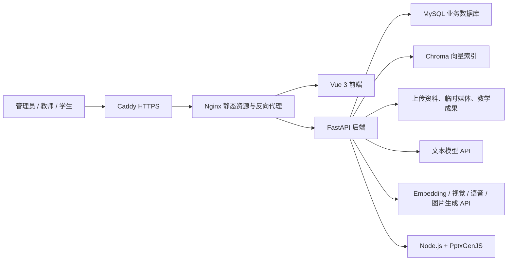

# 高校思政课 AI 智能教学辅助平台项目说明

> 文档版本：v2026.08.11-matching  
> 适用范围：项目汇报、系统交接、试运行说明和部署验收

## 一、项目概述

高校思政课 AI 智能教学辅助平台面向高校思政课程的教学、学习和资料治理场景，围绕“课程—章节—知识点—学习阶段”组织 AI 能力。平台不是通用聊天工具，而是把课程上下文、可核验资料、教师审核和学习过程纳入同一业务闭环。

系统服务于管理员、教师和学生三类用户：管理员负责账号、课程、教材和权威资料治理；教师负责备课、教学班、任务和教学成果发布；学生完成课程学习、作业、笔记、复习和课堂互动。AI 只提供辅助分析与内容草稿，正式资料发布、政策变化确认和教学成果发布均保留人工确认环节。

## 二、建设目标

1. 以教材和权威原文为主要依据，降低通用模型脱离课程语境回答的问题。
2. 将资料导入、检索、引用、更新发现和人工审核连接为可追踪流程。
3. 为教师提供从教学任务、证据、课纲到 PPT、教案和课堂活动的备课闭环。
4. 为学生提供阶段化学习助手、学习进度、任务、笔记和间隔复习能力。
5. 通过权限、审计、数据隔离和发布确认机制，使 AI 能力适合教学试运行环境。

## 三、用户角色

| 角色 | 主要职责与能力 |
|---|---|
| 管理员 | 审核教师账号，管理课程与章节，导入和发布教材/中央材料，维护权威来源，审核资料候选与政策变化，管理 AI 能力配置 |
| 教师 | 管理教学班和学生名单，布置任务，使用备课 Agent，生成并编辑教学成果，发布 PPT 与课堂活动，导入班级范围内的教学资料 |
| 学生 | 学习课程章节，使用阶段化 AI 助手，提交作业，记录个人笔记，执行间隔复习，参与课堂互动并下载教师发布的资料 |

教师注册后需要管理员审核。被停用或待审核教师不能继续访问受保护的教学功能。课程和章节等全局基础数据由管理员维护，教师资料和教学成果按用户或教学班进行隔离。

## 四、核心功能

### 4.1 课程与教学班

- 课程、章节和章节正文管理；
- 教学班、学期、主讲教师和协作教师管理；
- 学生名单导入、入班审批和分组；
- 同课程同学期的在班关系校验；
- 教学任务、截止时间、提交和批阅流程。

### 4.2 学生学习支持

- 按课程、章节和学习阶段记录学习进度；
- 基于 SSE 的 AI 流式回答和多轮对话；
- 课程资料检索、来源引用和上下文说明；
- 图片理解与语音转文字；
- 专题个人笔记和富文本编辑；
- 1、2、4、7、15、30 天间隔复习；
- 课堂活动参与和已发布课件下载。

### 4.3 教师备课 Agent

教师备课采用“设置任务—构建证据—生成课纲—生成成果—预览发布”的阶段式流程：

1. 教师确定课程、章节、教学目标和使用场景；
2. 系统检索教材和已发布资料，形成可确认的证据快照；
3. 教师确认依据后生成课纲；
4. 课纲确认后生成 PPTX、Word 教案和课堂活动设计；
5. 教师可以修改指定页面、恢复历史版本并进行最终核验；
6. 教师明确确认后，成果才会发布到指定教学班。

PPT 使用 PptxGenJS 生成可编辑文件，支持页数、视觉风格、内容密度、互动偏好和 PPTX 风格参考。可选多模态能力可以生成辅助插图，失败时自动回退为 PowerPoint 原生图形，不阻断课件生成。

### 4.4 三层资料中心

资料按以下层级管理：

| 层级 | 说明 | 主要管理者 |
|---|---|---|
| 中央材料 | 政策文件、权威讲话和公开原文，发布前需要确认教材或专题范围 | 管理员 |
| 教材正文 | 教材版本、章节、知识点、PDF 物理页和印刷页校准 | 管理员 |
| 地方材料 | 地方政策、案例和教师补充资料，可限制到本人教学班 | 管理员、已审核教师 |

系统支持文本型 PDF、TXT、Markdown，以及中央材料 URL、CSV、XLSX、XLS 批量导入。批量任务持久化保存进度和失败明细，服务重启后可以恢复。扫描版 PDF 当前不内置 OCR，需要先转换为可检索文本。

AI 检索会进行专题过滤和权威层级加权，保留网页原始地址以及 PDF 页码。缺少某一层相关资料时不会为了满足数量要求而生成虚假来源。

### 4.5 权威资料发现与教材匹配

管理员可以维护政府网站、教育部门和权威媒体等 HTTPS 白名单来源，并手动启动后台发现任务。系统依次完成：

```text
来源校验 -> 网页抓取 -> 正文提取 -> 快照与去重 -> 主题筛选
        -> 教材章节召回 -> 差异证据 -> 管理员审核 -> 正式发布/提醒
```

教材匹配使用 BM25、向量检索和中文词项匹配进行多路召回，再通过 RRF 融合排名。基础部署采用轻量确定性门控；具备足够计算资源时，可以单独安装 BGE Cross-Encoder 和中文 NLI 模型进行精排。任何可选模型加载或推理失败都会回退到确定性路径。

章节匹配置信度与新旧句段证据置信度分开保存。只有主题条件成立、章节置信度和证据置信度同时达到告警阈值时，系统才会给出“建议提醒”。候选、差异和提醒都需要管理员确认，不会自动修改正式知识库。

### 4.6 AI 能力管理与审计

- 文本生成、Embedding、图片理解、语音识别和图片生成分别配置；
- 支持 OpenAI 兼容接口、DeepSeek 和阿里云百炼等外部服务；
- 能力配置可独立启用、测试和切换；
- AI 调用审计记录功能、模型、状态、输入输出字符数、Token 和耗时，不保存完整提示词及回答正文；
- 用户可见的 AI 生成内容带有明确标识。

## 五、系统架构



### 技术栈

- 前端：Vue 3、TypeScript、Vite、Vue Router、Pinia、Element Plus；
- 后端：Python、FastAPI、SQLAlchemy、Alembic、Pydantic；
- 数据库：开发环境可使用 SQLite，生产环境使用 MySQL；
- 检索：Chroma、BM25、Embedding 和分层 RAG；
- 教学成果：Node.js 24、PptxGenJS、python-docx；
- 网关与部署：Caddy、Nginx、Docker Compose，或 systemd 宿主机部署；
- 测试：Pytest、前端类型检查和 Vite 生产构建。

## 六、主要业务闭环

### 学习闭环

```text
进入课程 -> 选择章节和阶段 -> 学习/提问 -> 引用资料回答
       -> 记录进度与笔记 -> 完成任务 -> 间隔复习
```

### 备课闭环

```text
设置备课目标 -> 检索并确认证据 -> 生成并确认课纲
          -> 生成/修改教学成果 -> 教师核验 -> 发布到教学班
```

### 资料治理闭环

```text
导入或发现原文 -> 保存快照 -> 匹配教材 -> 生成差异证据
            -> 管理员审核 -> 发布知识库 -> 通知相关教师
```

## 七、安全与数据治理

- 全站通过 HTTPS 提供服务，生产环境不应使用明文 HTTP 登录；
- 使用 JWT 和基于角色的权限控制保护接口；
- 教师账号状态会在受保护请求中持续校验；
- 上传文件校验扩展名、MIME、文件魔数、大小和配额；
- 图片和录音属于临时私有资产，具有用户配额和 TTL 清理机制；
- 外部 URL 和每次重定向均校验 HTTPS、白名单、公网地址及主机一致性，防止 SSRF；
- 不通过 `verify=False` 绕过来源网站证书异常；
- 资料发布、政策变化确认和教学成果发布均需要人工操作；
- 生产密钥只存放在环境配置或加密字段中，不进入代码仓库；
- MySQL、Chroma、上传资料和生成成果需要统一纳入备份。

## 八、部署与运行

推荐生产环境使用 Docker Compose，并使用外部 MySQL。当前试运行服务器采用 Caddy + Nginx + systemd Uvicorn + 本机 MySQL 的宿主机部署方式。两种方式都必须保证：

1. 数据库迁移只由一个实例执行；
2. 迁移前备份 MySQL 和持久化目录；
3. 不执行会删除数据卷的 `docker compose down -v`；
4. 后端仅监听内网或回环地址；
5. 公网只开放必要的 80/443 端口；
6. 使用 `/api/v1/health` 和 `/api/v1/ready` 进行存活与数据库就绪检查。

当前试运行地址：<https://47.105.125.153/login>

公网 IP 使用短期证书并由 Caddy 自动续期。取得正式域名后，应将域名解析到服务器并切换为正式域名证书。

## 九、当前状态

截至 `v2026.08.11-matching`：

- 核心课程、教学班、学习、作业、笔记和复习流程已实现；
- 三层资料中心、分层 RAG 和来源引用已实现；
- 教师备课 Agent、PPTX/Word/课堂活动生成及发布闭环已实现；
- 权威资料发现、教材章节匹配、差异证据和管理员审核已实现；
- 图片、语音和多模态课件辅助能力已接入；
- 数据库迁移 head 为 `20260811_01`；
- 后端全量自动化测试为 `258 passed`；
- 前端类型检查和生产构建通过。

## 十、当前边界与后续方向

- 扫描版 PDF 尚未集成 OCR；
- 外部模型生成速度和稳定性受供应商服务影响；
- 小规格服务器只启用轻量匹配，不启用本地 BGE/NLI 模型；
- 权威资料定时调度默认关闭，应先人工验证来源和抓取规则；
- 当前后台 dispatcher 适合单进程部署，多实例需要迁移到独立任务队列和分布式锁；
- 本地开源模型正式启用前需要独立模型镜像、持久化缓存、资源评估和离线标注集校准；
- 生产试运行仍需要持续开展管理员验收、模型效果评估、监控告警和恢复演练。

## 十一、相关文档

- [README](../README.md)
- [API 说明](api.md)
- [系统架构](architecture.md)
- [部署说明](deployment.md)
- [开发说明](development.md)
- [权威资料发现第一阶段](authority-discovery-phase1.md)
- [权威资料发现与教材匹配](authority-discovery-phase2.md)

